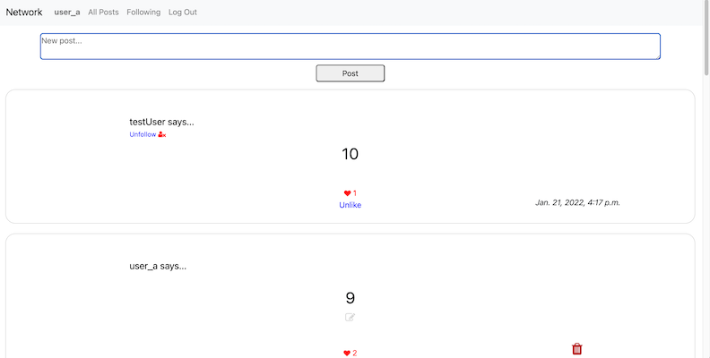

# Network

Project 4 of CS50w Web Programming with Python and JavaScript.\
<<<<<<< HEAD
Design a Twitter-like social network website for making posts and following users.
=======
Design a Twitter-like social network website for making posts and following users. [Demonstration video](https://youtu.be/XgmpUVYpxCI)
>>>>>>> web50/projects/2020/x/network

[Full project specification](https://cs50.harvard.edu/web/2020/projects/4/network/)

Features:

-Create, edit, delete posts\
-Like/ Unlike posts\
-Follow/ Unfollow users\
-View user profiles\
-View all/ specific-user or followed-user posts

<<<<<<< HEAD
[Demonstration video](https://youtu.be/XgmpUVYpxCI)

=======

>>>>>>> web50/projects/2020/x/network

## Setup

Clone repository

```
git clone https://github.com/whejy/cs50w-project4-network.git
cd project4
```

Install dependencies

```
pip install -r requirements.txt
```

Run server

```
python manage.py runserver
```
